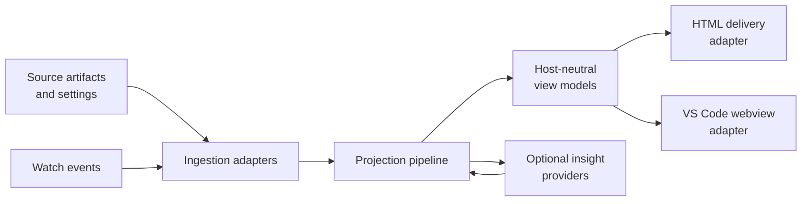

# SpecScribe Architecture Spine

## Paradigm

Shared-core, adapter-per-surface, local-first, read-only.

The architectural invariant is simple: parsing, projection, enrichment, and view-model shaping happen once; delivery varies by host.

## Inherited Invariants

- SpecScribe remains local-only and read-only.
- All user-facing features stay configurable through interactive options and equivalent CLI parameters.
- Settings persist in a directory-scoped settings file and CLI overrides win for a run.
- Baseline generation stays responsive; deep analytics remain optional.
- Unsupported or malformed artifacts degrade gracefully instead of blocking generation.
- CLI, static HTML, and VS Code webview surfaces must consume the same shared projection/rendering core.
- Shared HTML/webview views (dashboard and epics drill) must preserve the same interaction/state semantics even when transport differs.
- Accessibility semantics (keyboard drill behavior, labels, and status text redundancy) are part of the rendering contract, not optional skinning.

## Architecture Decisions

### AD-1 [ADOPTED] One shared projection/rendering core feeds every surface

Binds: framework adapters, projection, traceability, coverage classification, insight enrichment, and presentation-ready view models.

Prevents: duplicated parser logic, HTML/webview feature drift, and surface-specific traceability bugs.

Rule: framework parsing and projection live in one core pipeline; adapters only translate that core output into host delivery concerns.

### AD-2 [ADOPTED] Host-neutral view models are the contract between core and adapters

Binds: page models, navigation graph, asset manifest, and render metadata.

Prevents: HTML template details leaking into the webview path and webview host APIs back-propagating into the CLI renderer.

Rule: the shared renderer emits stable typed view models; adapters consume them without reinterpreting source artifacts.

### AD-3 [ADOPTED] Settings resolve once from directory scope plus run overrides

Binds: source/output paths, framework enables, git depth, ADR coverage controls, and other user-facing toggles.

Prevents: hidden runtime state, inconsistent CLI versus interactive behavior, and per-adapter configuration forks.

Rule: the effective config is resolved before generation/watch starts, then passed through the pipeline with provenance preserved.

### AD-4 [ADOPTED] Optional insight providers may enrich output but never own baseline success

Binds: git pulse, ADR coverage, agent-file structure signals, and future local insights.

Prevents: deep analytics from blocking baseline generation or turning optional analysis failures into fatal errors.

Rule: insight providers are additive, non-blocking, and independently toggleable from the core render path.

### AD-5 [ADOPTED] Watch mode treats changed scope as the unit of recomputation

Binds: incremental file change handling, epics/story regeneration, ADR refresh, and output atomics.

Prevents: stale output from rename/delete events and unnecessary full-tree rebuilds on leaf edits.

Rule: watch mode may rebuild narrowly when safe, but topology changes can trigger a broader refresh to keep output coherent.

### AD-6 [ADOPTED] IDE helpers stay read-only and explicit

Binds: prompt-generation buttons, command handoff helpers, and future webview affordances.

Prevents: editor actions from mutating source planning artifacts or becoming a hidden authoring path.

Rule: helpers can generate prompts or commands, but any write action remains an explicit external choice.

### AD-7 [ADOPTED] Presentation tokens are shared; host chrome is host-owned

Binds: brand/status token families, component-level visual semantics, and cross-surface readability.

Prevents: ad hoc per-surface styling drift and accidental dependence on browser-only or webview-only theme primitives.

Rule: SpecScribe owns its presentation tokens for content semantics; webview maps host variables for container/chrome while preserving SpecScribe semantic accents.

### AD-8 [ADOPTED] Interaction state contract is canonical; update transport is adapter-specific

Binds: drill depth semantics, breadcrumb/state transitions, focus/keyboard behavior, and freshness signaling.

Prevents: dashboard behavior divergence between static HTML and webview and re-implementation of interaction logic per host.

Rule: interaction state shape is shared (for example drill scope and status semantics); static HTML may hydrate via URL hash plus sidecar polling, while webview uses extension host push.

## Seed, Not Invariant

- Exact namespace or package split is a seed choice, not a contract; the current monolithic implementation can be refactored as long as the shared-core contract stays intact.
- Exact adapter loading mechanics and exact file layout for HTML/webview delivery are implementation seeds.
- Coverage-tier wording and the next promoted Agent Files remain open until the portal wording proves stable in use.
- Exact visual polish values (timings, shadows, micro-motion tuning) are seed-level as long as shared semantics and accessibility invariants remain intact.

## Runtime Flow

## Deferred

- Exact presentation wording for rendered, summarized, and unsupported tiers.
- The concrete package split for core, rendering, and delivery layers.
- The adapter discovery mechanism for future framework modules.
- The promotion criteria for additional Agent Files once Core + Orchestration coverage is stable.
