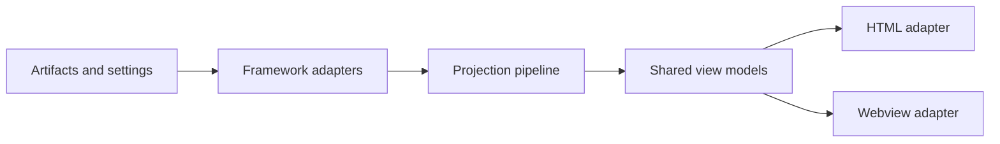

# ADR 0002: Preserve a Shared Rendering Core with Host-Neutral View Models

**Status:** Accepted
**Date:** 2026-07-05
**Deciders:** Matt Eland

## Context

SpecScribe already parses BMad artifacts and is explicitly committed in the PRD and SPEC to support a future VS Code webview without forking the parsing brain. The codebase currently has one CLI and one HTML site generator, but the product direction now includes two delivery surfaces: static HTML now, webview later.

The architectural risk is predictable drift. If HTML templates, webview presentation, or parser/projection logic each evolve independently, the tool will eventually answer the same question differently depending on where the user looks.

## Decision

Keep one shared projection/rendering core that produces host-neutral view models. HTML and VS Code webview remain delivery adapters only.

## Consequences

**Positive**

- Traceability, navigation, and coverage semantics stay consistent across delivery surfaces.
- New rendering behavior is implemented once and exposed everywhere that needs it.
- Contract tests can focus on the core model instead of duplicating surface-specific expectations.

**Negative / trade-offs**

- The shared core will need stronger interface discipline than a surface-specific renderer.
- Some host-specific concerns will stay awkward until the adapter layer is fleshed out.

## Considered Options

### Separate renderer per surface

Build a dedicated HTML renderer and a separate webview renderer with only loose coordination.

- **Pros:** Easy to start in each surface.
- **Cons:** High drift risk and duplicate logic for navigation, traceability, and coverage semantics.

### Shared core with delivery adapters only (chosen)

One rendering brain, multiple delivery paths.

- **Pros:** Single source of truth for user-visible semantics; easier parity enforcement.
- **Cons:** Requires a careful adapter boundary and slightly more up-front design work.

## References

- [SpecScribe Architecture Spine](_bmad-output/specs/spec-specscribe/ARCHITECTURE-SPINE.md)
- [SPEC: SpecScribe](_bmad-output/specs/spec-specscribe/SPEC.md)
