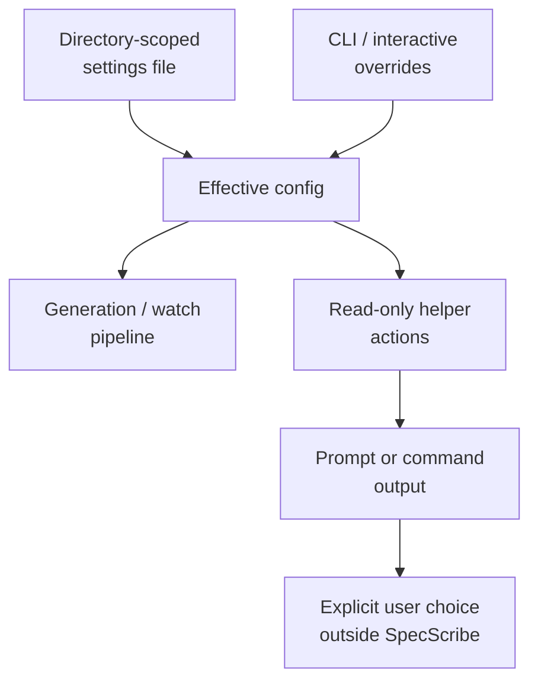

# ADR 0003: Keep Settings Directory-Scoped and IDE Helpers Read-Only

**Status:** Accepted
**Date:** 2026-07-05
**Deciders:** Matt Eland

## Context

The PRD and SPEC both require every user-facing feature to be configurable through interactive options and equivalent CLI parameters, with settings persisted per source directory. They also require the VS Code surface to remain read-only and helper-oriented.

That means configuration cannot live only in process memory, and IDE actions cannot quietly become an authoring surface. The tool needs one predictable settings path and one predictable behavior for helper actions.

## Decision

Resolve effective settings from the active source directory plus run overrides, and keep IDE helpers limited to generating prompts or commands rather than editing project artifacts.

## Consequences

**Positive**

- Project behavior is reproducible across CLI, watch, and in-editor contexts.
- Settings can be shared within a repository without depending on a machine-wide profile.
- The extension stays aligned with the current read-only/local-first posture.

**Negative / trade-offs**

- Helper flows may feel less magical than a full editor automation layer.
- The settings resolver has to carry provenance and override precedence explicitly.

## Considered Options

### In-memory or machine-wide settings

- **Pros:** Simpler to prototype.
- **Cons:** Poor repository portability and hard-to-reproduce behavior across collaborators.

### Directory-scoped settings with explicit overrides (chosen)

- **Pros:** Matches repository-local usage and keeps runs reproducible.
- **Cons:** Requires one more persisted file per project.

## References

- [SpecScribe Architecture Spine](_bmad-output/specs/spec-specscribe/ARCHITECTURE-SPINE.md)
- [Settings and Signals](_bmad-output/specs/spec-specscribe/settings-and-signals.md)
