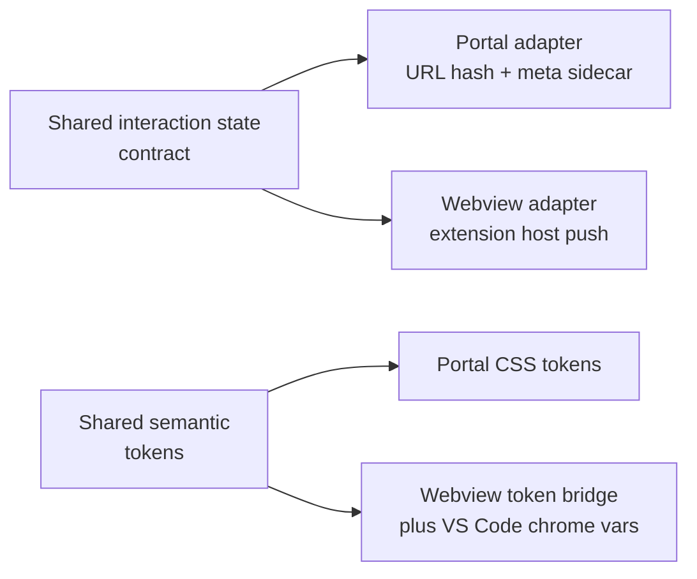

# ADR 0004: Preserve Cross-Surface Interaction Semantics and Host-Aware Theme Boundaries

**Status:** Accepted
**Date:** 2026-07-05
**Deciders:** Matt Eland

## Context

The UX package introduces concrete interaction and presentation contracts for the generated portal and the planned VS Code webview: shared drill behavior, shared status semantics, accessibility floor requirements, and a warm brand token system that must still respect host chrome in VS Code.

Without an architecture-level boundary, these rules can degrade into per-surface implementations that look similar but behave differently.

## Decision

For shared views, SpecScribe preserves one interaction/state contract and one semantic token contract across HTML and webview.

- Interaction semantics are canonical (drill hierarchy, breadcrumb behavior, keyboard navigation, status meaning).
- Delivery transport can differ by host (hash/poll for static HTML, host-push for webview).
- SpecScribe semantic accents remain product-owned while webview container/chrome styling maps to VS Code variables.

## Consequences

**Positive**

- Contributors can reason about one behavior model instead of surface-specific variants.
- Accessibility and status semantics stay consistent where users compare views.
- The webview can feel native in VS Code chrome without losing SpecScribe identity.

**Negative / trade-offs**

- Adapter boundaries need clearer tests around shared behavior and token mapping.
- Some host-native UI affordances may be deferred when they would violate shared semantics.

## References

- [SpecScribe Architecture Spine](_bmad-output/specs/spec-specscribe/ARCHITECTURE-SPINE.md)
- [SpecScribe Design](_bmad-output/planning-artifacts/ux-designs/ux-SpecScribe-2026-07-05/DESIGN.md)
- [SpecScribe Experience](_bmad-output/planning-artifacts/ux-designs/ux-SpecScribe-2026-07-05/EXPERIENCE.md)
