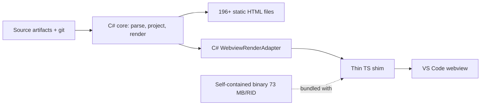
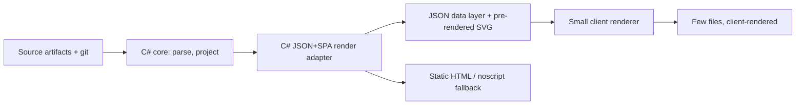
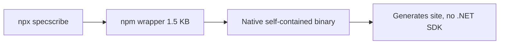
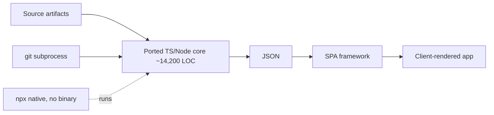
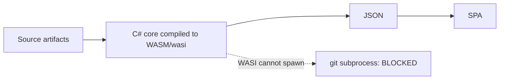

# ADR 0006: Delivery Architecture & Distribution — JSON + SPA + npx vs. the C# Static-Site + Bundled-Binary Path

**Status:** Accepted (ratified by owner 2026-07-10; see "Decider's note")
**Date:** 2026-07-10
**Deciders:** Matt Eland
**Amends:** [ADR 0005 — VS Code Webview Runtime and Packaging](0005-vs-code-webview-runtime-and-packaging.md) (re-affirmed, not superseded — see Decision)

## Context

ADR 0005 was Accepted on 2026-07-10 on the premise "rendering stays in C#, minimize TypeScript," with packaging =
"bundle a ~73 MB/RID self-contained .NET binary in the VSIX." Immediately after it landed, the owner reopened that
premise, leaning toward **pure TypeScript — possibly a SPA framework — distributed via npx**, citing three concerns:

1. **Output-file bloat** — the static-site generator emits one HTML file per artifact (196 HTML files for *this*
   repo today; Epic 7's per-source-file / per-commit / per-date pages multiply that into the thousands on a large repo).
2. **Extension bloat** — ADR 0005's "just works on install" answer is a ~73 MB/RID self-contained binary in the VSIX;
   the owner wants a **thin** rendering surface driven by a JSON layer, not a fat binary.
3. **CI/distribution friction** — a .NET tool needs the runtime or a self-contained publish; **npx** is far
   lower-friction for SpecScribe's spec-driven-dev / JS audience.

Story 6.6 was seated as a **measurement spike** (mirroring how Story 6.3 de-risked the webview seam) to decide **by
numbers, not argument**, across four *separable* axes — and to record the result here. It **gates** Epic 6 Stories
6.4/6.5 and Epic 16's packaging stories, all of which were frozen pending this ADR. The spike code is throwaway,
quarantined under [`spike/delivery/`](../../spike/delivery); this ADR is the durable deliverable.

### The four axes (measured separately, because only their *combination* forces a rewrite)

| Axis | Poles | What the spike measured |
|---|---|---|
| **A. Output form** | many static HTML files ↔ few files + a JSON layer a client renders | file count, total bytes, JSON payload size, chart-mass share, client render latency |
| **B. Rendering language** | C# emits finished HTML ↔ TS/SPA renders from JSON | the accessibility consequence (NFR6) |
| **C. Analysis language** | C# core stays ↔ ported to TS | the port surface (LOC/tests/risk) + coupling-breakers |
| **D. Distribution** | `dotnet tool` / `dnx` ↔ npm / npx | package size, cold-run latency, cross-platform, .NET-free run |

### Evidence base (measured against *this* repo, 2026-07-10)

All numbers are reproducible from [`spike/delivery/`](../../spike/delivery) (exporter + SPA + npm wrapper) and the
harness in that folder's README. They reuse ADR 0005's already-measured figures where those still hold.

**Axis A — output form & bloat.** A throwaway C# exporter emitted a JSON data layer for the dashboard + epics from
Story 6.2's section view models; a ~90-line vanilla-JS SPA renders both surfaces from it with in-view navigation.

- **Static site today:** 196 HTML files + 1 CSS + 1 JS = **198 files, 5.88 MB** (5.73 MB HTML). Cold generate 3.2 s,
  warm 3.2 s (dominated by ingest + `git` subprocess, per ADR 0005; .NET startup is ~0.4 s of it).
- **Chart mass dominates the rich pages.** Inline `<svg>` is **69.3 %** of the dashboard body (117,642 of 169,831 B,
  107 charts) and **58.9 %** of the epics body (58,383 of 99,102 B, 18 charts). Site-wide: 2,469 inline SVGs = 1.37 MB.
- **The structured (non-chart) data layer for both surfaces is 13.5 KB.** That is the floor a TS renderer could
  consume — *if* it also regenerated every chart itself.
- **Client render is trivial:** fetch 35 ms, render 7.9 ms (dashboard) / 6.9 ms (epics); the 107 chart SVGs paint from
  the injected pre-rendered body.
- **Epic-7 file-count extrapolation (this small repo):** +737 per-source-file + 119 per-commit + 7 per-date pages ≈
  **+863 pages → ~1,060 files**. A large repo (thousands of files/commits) reaches **thousands to tens of thousands**
  of files. The file-count concern is **real and large**.

**The axis-A crux:** a JSON layer that ships **pre-rendered** SVG does **not** shrink bytes (payload ≈ today's
170 KB dashboard). Only **porting chart generation to TS** reaches the ~13.5 KB data floor — i.e., the byte win
requires axis B/C, but the **file-count** win does not (a JSON+SPA output form is deliverable as a C# adapter).

**Axis D — npx distribution (proven end-to-end).** A `dotnet publish -r win-x64 --self-contained
-p:PublishSingleFile=true` produced a **73.0 MiB** single-file exe (**34.2 MB gzipped** — the per-RID npm/VSIX cost),
matching ADR 0005's ~73 MB. An **npm-wrapper-around-native-binary** package (the esbuild/Biome pattern; wrapper tarball
**1,558 bytes**) resolves and spawns that binary. Installing the wrapper tarball and running its `bin` **generated all
196 HTML files in 3.7 s with no .NET SDK or runtime involved** — the binary carries its own runtime. **npx is
achievable now, with no port.**

**Axis C — the port surface (enumerated, not performed).** "Pure TypeScript for the application" ⇒ porting
**~14,200 production LOC across 87 `.cs` files + the ~676-case / 55-file test suite**:

| Subsystem | LOC | Port risk |
|---|---:|---|
| Parsing/ingest (Markdig AST walk + YAML frontmatter, epics/req/sprint/retro/task parsers) | 1,629 | **Medium** — needs a JS markdown parser with AST access (remark/markdown-it) + js-yaml |
| Custom Markdig renderers/rewriters (Mermaid, comment annotations, link rewriters, gherkin/capability stylers) | 889 | **High** — hooks into Markdig's pipeline; a rewrite, not a translation. **Markdig fidelity is the flagged risk.** |
| Charts → inline SVG (donut, sunburst, funnel, sankey, heatmap, mosaic, sprint board, stat cards, bars) | 1,425 | **Medium** mechanically, **large** surface — this is the axis-B cost; nothing else shrinks the payload |
| Templaters + render adapter + view models | 4,691 | **Medium** — mechanical but the bulk; only ported if rendering leaves C# (axis B) |
| Projection/calc, models | 1,750 | **Low** — portable logic + data records |
| Git (`GitMetrics`, incl. deep-git numstat parsing) | 604 | **Medium** — `git` subprocess ports to Node, but the deep-git numstat/log parsing is fiddly and already bug-prone (memory: deep-git-single-numstat-path) |
| CLI / IO / watch / settings | 2,532 | **Medium** — Spectre.Console→commander/yargs, FileSystemWatcher→chokidar |

Plus re-porting ~676 tests. Two clusters carry genuine fidelity risk — **Markdig extensions** and **deep-git
parsing**; the rest is large-but-mechanical.

**Coupling-breakers (axis C):**

- **(a) WASM.** Compiling the C# core to a Node-callable `wasi` artifact would remove the per-RID matrix (one `.wasm`
  for all platforms). **Hard blocker:** WASI preview-1 cannot **spawn `git`**, and SpecScribe's git pulse + deep-git
  analytics depend on the `git` subprocess. A WASM core would need the JS host to run `git` and feed text in — a real
  re-architecture of the git seam, not a drop-in. Desk-research verdict (time-boxed, no build): **not a cheap breaker;
  the git-subprocess blocker is decisive on paper.**
- **(b) Pre-generated JSON.** CI (or a watch process) runs the C# tool once to emit JSON; the SPA + VS Code webview
  only *consume* it. **Cheapest breaker — zero port.** The C# core stays authoritative; delivery becomes a JSON+client
  form. **Tradeoff:** live in-editor regeneration still needs the binary present (bundled or npx'd) to re-emit the
  JSON — a view-only consumer cannot regenerate without it.

## Architectures Considered

Five delivery architectures were weighed. Each flow diagram reads left-to-right: source → processing → delivery. The
distinction that decides the outcome is **where the process-boundary and the language-boundary fall** — because only
moving *analysis* across the language boundary (C) forces the expensive rewrite.

### A. Current — ADR 0005 (C# static site + C# webview + bundled binary) — *re-affirmed baseline*

C# parses, projects, and renders finished HTML: one file per artifact for the static site, and webview-ready HTML
for the VS Code panel (rendered by a C# `WebviewRenderAdapter`, driven by a thin TS shim). "Just works on install"
is met by bundling a self-contained binary.

### B. JSON + SPA delivery adapter (C# still renders) — *adopted, additive*

A second `IRenderAdapter` (the Story 6.1 seam) consolidates the many-files output into a JSON data layer + a small
client renderer. Rendering **stays in C#**; the static HTML remains as the accessible `noscript` fallback (free,
because the core already emits it). Addresses the file-count concern **without any TS port**.

### C. npx via npm-wrapped native binary — *adopted, additive*

A ~1.5 KB npm wrapper (the esbuild/Biome pattern) resolves and spawns the self-contained binary through
`optionalDependencies`. Proven end-to-end: `npx` generated all 198 files (196 HTML) with **no .NET SDK present**. No port.

### D. Full pure-TS SPA + ported core — *deferred*

The owner's original lean: analysis and rendering both move to TypeScript/Node, distributed via npx natively with no
binary. This is the only option that fully eliminates the native binary **and** keeps live in-editor regeneration —
but it requires porting ~14,200 LOC + 676 tests, with Markdig-fidelity and deep-git parsing as the flagged risks.

### E. WASM core called from Node — *rejected*

Compiling the C# core to a Node-callable `wasi` artifact would give one cross-platform binary and avoid the port.
Blocked on paper: WASI preview-1 cannot spawn `git`, and the git-pulse + deep-git analytics depend on the `git`
subprocess. It would require re-architecting the git seam so the JS host runs `git` — not a drop-in.

### Comparison (measured against *this* repo, 2026-07-10)

| Architecture | Files (this repo → Epic-7 scale) | Body bytes | Distribution | Live in-editor regen | Port cost | NFR6 fallback | Verdict |
|---|---|---|---|---|---|---|---|
| **A. Current (ADR 0005)** | 198 → ~1,060 (thousands on big repos) | full (SVG-heavy) | `dotnet tool` / bundled 73 MB/RID | binary present | none | native static HTML | **Re-affirmed** |
| **B. JSON + SPA adapter (C#)** | few → few | ~same (pre-rendered SVG ships) | via binary / npx | binary present | none (additive `IRenderAdapter`) | static / `noscript` (free) | **Adopted (additive)** |
| **C. npx npm-wrapper** | n/a (distribution) | n/a | **npx, no .NET SDK (proven)** | binary present | none | n/a | **Adopted (additive)** |
| **D. Full pure-TS SPA + port** | few → few | ~13.5 KB data floor (charts re-rendered in TS) | npx native, no binary | in Node (native) | **~14,200 LOC + 676 tests**; Markdig + deep-git risk | needs SSR/build for fallback | **Deferred** |
| **E. WASM core from Node** | few → few | data floor | one `.wasm`, all platforms | **blocked** | git-seam re-architecture | — | **Rejected** (WASI can't spawn `git`) |

**Key measured figures** (full detail in the Evidence base below): inline SVG is **69.3 %** of the dashboard body /
**58.9 %** of epics — so a JSON layer shipping pre-rendered SVG cuts *file count* but not *bytes* (the structured
data floor is 13.5 KB, reachable only by porting chart generation). npx wrapper: **1,558-byte** tarball, generated
**198 files (196 HTML) in 3.7 s** with no .NET SDK. Self-contained binary: **73 MiB / 34 MB gzipped** per RID. Client render:
fetch 35 ms + render ~7–8 ms.

## Decision

**Re-affirm ADR 0005's core — C# remains SpecScribe's rendering and analysis engine, shipped as a self-contained
binary — and AMEND it with two additive, port-free changes. Defer (do not adopt) the full "pure-TypeScript SPA +
ported core" pivot.** The measured basis:

**The coupling the spike was asked to confirm or break is BROKEN for each concern individually, and holds only for
the full simultaneous set.** "Thin extension + live in-editor regen + npx + *no binary anywhere* ⇒ generation in Node
⇒ analysis in TS" is true **only** if every clause is required at once. Taken one at a time:

1. **File bloat (axis A) → a new C# JSON + client-renderer delivery adapter.** Realized as a second `IRenderAdapter`
   (the Story 6.1 seam), rendering **stays in C#**; the output *form* consolidates many HTML files into few files +
   a JSON layer + a small client renderer. Deliverable **without any TS port**. It addresses the file-count concern
   (the large one at Epic-7 scale). It does **not** shrink bytes — the chart SVGs still ship — but it removes the
   thousands-of-files problem, which is the actual concern.

2. **npx distribution (axis D) → npm-wrapper-around-native-binary as the primary CLI channel.** Proven end-to-end in
   the spike (1.5 KB wrapper + ~34 MB gz per-RID binary via `optionalDependencies`, `npx` runs it with no .NET
   present). This is the lower-friction channel the JS/SDD audience wants; `dnx` / `dotnet tool` remains a secondary
   channel for .NET users. **No port.**

3. **Extension bloat** is the *only* concern that truly needs the binary gone — and even it is softened by the
   **pre-generated-JSON breaker**: a thin *consumer* webview/SPA loads committed JSON + a small JS bundle (no 73 MB
   binary in the view path), with regeneration delegated to the binary (bundled once, or run via npx/CI on change).
   Full elimination of the native binary *and* live in-editor regeneration is the one outcome that forces the port
   (or a WASM-with-git-host-bridge re-architecture). The evidence does not justify paying ~14,200 LOC + 676 tests of
   port — with Markdig-fidelity and deep-git risk — to reach it now.

**Therefore ADR 0005 is re-affirmed (not superseded).** Its data path (C# renders webview/HTML), its self-contained
packaging, and its spawn-the-tool invocation all stand. ADR 0006 **adds**: (i) npx as a first-class distribution
channel, and (ii) an optional JSON+SPA delivery adapter as an alternate output form for file-count-sensitive contexts
(large repos, the webview). The full-TS pivot is **deferred**, not rejected forever: if "no native binary in the
extension, with live in-editor regen" later becomes a hard requirement, that is its own epic, gated on a
WASM-git-bridge feasibility proof.

### Accessibility posture for JS-rendered surfaces (NFR6 — the ruling the AC requires)

The [Client-Side Enhancement Policy](../../_bmad-output/specs/spec-specscribe/rendering-architecture.md) and NFR6
require that **core content and navigation render and work with JavaScript disabled — JS adds convenience, never
information.** A SPA that *renders the information from JSON in the client* violates that policy on its face.

**Ruling:** the JSON+SPA delivery form is an **additional** form layered over the static-HTML baseline, never its
replacement. Concretely: (a) the static HTML surface remains the accessible, JS-optional baseline and the source of
truth; (b) any JSON+SPA output MUST ship a static fallback — either the pre-rendered HTML for each surface (which the
C# core already produces) served under `<noscript>`, or the static site alongside. Because the charts are pure inline
SVG and carry their data as SVG + links (ADR 0005 §4–5), a pre-rendered fallback is **free** — the C# core emits it
already. This is a further reason the JSON adapter stays a **C# render**, not a TS re-render: it keeps the accessible
fallback at zero extra cost. The webview's "reach the same information without enhancement scripts" guarantee (ADR
0005 §5) is unchanged.

### Decider's note

The spike's recommendation **reverses the owner's original lean** (toward a pure-TS SPA + ported core): the numbers
show the three concerns are each addressable without the port, and the port is expensive (~14,200 LOC + 676 tests)
and risky (Markdig fidelity, deep-git parsing). It was therefore issued as **Proposed** for an explicit decision.

**Ratified by the owner (Matthew-Hope Eland) on 2026-07-10** — Status is now **Accepted**. The full-TS pivot (option D)
is **deferred, not rejected**: if "no native binary in the extension, with live in-editor regen" later becomes a hard
requirement, it is seated as its own epic gated on a WASM-git-bridge feasibility proof. The frozen stories unblock per
the re-plan below.

## Consequences

**Positive**
- No ~14,200 LOC / 676-test rewrite; Epics 1–4 + 3 are preserved. Markdig-fidelity and deep-git risk are not re-incurred.
- npx ships to the JS audience **now**, port-free (proven). CI needs no .NET SDK.
- The file-count concern gets a real answer (JSON+SPA adapter) that stays within the shared-core contract (AD-1/AD-2,
  NFR4) as an additive `IRenderAdapter` — no seed-level namespace split.
- The accessibility baseline (NFR6 + progressive-enhancement policy) is preserved for free, because C# keeps rendering
  and the pre-rendered fallback already exists.

**Negative / trade-offs**
- The JSON+SPA form does **not** reduce bytes (chart SVGs still ship); it only reduces *file count*. A true byte
  reduction is deferred with the port.
- The 73 MB/RID binary is **not** eliminated — it is still what regenerates content. The "thin extension with no fat
  binary and live regen" ideal is only partially met (thin *consumer*, binary still required to regenerate).
- Distribution now maintains **two** channels (npm/npx + `dotnet tool`) and a per-RID native-package matrix (Epic
  16.5's problem regardless).
- Deferring the pivot risks revisiting this if the extension-size ceiling becomes hard; the WASM-git-bridge path is
  named but unproven.

**Follow-on re-plan (Story 6.6 AC #5 — seated, not executed here)**
- **Unfreeze** Story 6.4 (webview runtime) and 6.5 (host theming) and Epic 16.1 — all built on ADR 0005, which stands.
- **Seat two additive stories** (via `correct-course`/`sprint-planning`): (1) *JSON + client-renderer delivery adapter*
  (a C# `IRenderAdapter` output form, with the static/`noscript` fallback) in Epic 6 or a new delivery epic; (2)
  *npm-wrapper-around-native-binary npx channel* in Epic 16 (alongside 16.3), promoting the spike's proven wrapper.
- **Do not** seat a C#→TS core-port epic. If the owner overrides this ADR toward the pivot, that port becomes its own
  epic, gated on a WASM-git-bridge feasibility spike (the one axis-C breaker left unproven).

## References

- **This spike:** Story 6.6 `_bmad-output/implementation-artifacts/6-6-delivery-architecture-and-distribution-spike.md`;
  code (throwaway) under [`spike/delivery/`](../../spike/delivery) — `exporter/` (C# JSON-layer exporter + bloat meter),
  `spa/` (vanilla-JS client renderer), `npm-wrapper/` (npx proof), and that folder's README (reproduction + numbers).
- **The decision re-affirmed:** [ADR 0005](0005-vs-code-webview-runtime-and-packaging.md).
- **Owner directive + freeze:** `_bmad-output/planning-artifacts/sprint-change-proposal-2026-07-10-delivery-architecture.md`.
- **What a pivot touches / what unfreezes:** Stories 6.4, 6.5; Epic 16 packaging stories (16.1/16.3/16.4/16.5).
- **Section view models the JSON layer serializes:** Story 6.2; `DashboardView.cs` / `EpicsView.cs` + builders;
  `tests/SpecScribe.Tests/SectionViewModelSerializationTests.cs` (the round-trip boundary).
- **Policy on the line:** [rendering-architecture.md — Client-Side Enhancement Policy](../../_bmad-output/specs/spec-specscribe/rendering-architecture.md); NFR6.
- **Architecture:** [ARCHITECTURE-SPINE.md](../../_bmad-output/specs/spec-specscribe/ARCHITECTURE-SPINE.md) — AD-1/AD-2
  (shared core; adapters translate, don't reinterpret), AD-6 (read-only), AD-7/AD-8 (interaction/theme transport),
  NFR4 (additive adapters), NFR6 (accessibility), NFR9 (reproducible CI).
- [ADR 0002](0002-shared-rendering-core-and-host-neutral-view-models.md) (shared rendering core — the invariant this
  decision preserves).
