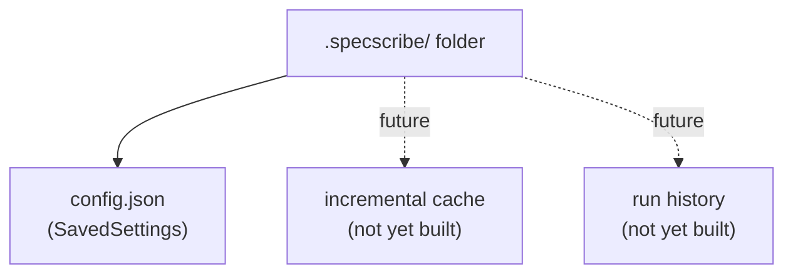

# ADR 0014: `.specscribe` Is a Settings Folder, Not a Flat File

**Status:** Accepted
**Date:** 2026-07-25
**Deciders:** Matt Eland

## Context

ADR 0003 established that effective settings resolve from a directory-scoped settings file plus run overrides, with a
git-style walk-up (Story 5.2) so a run started in any subdirectory still finds the settings that govern the whole
repository. Until now, `.specscribe` has been that walk-up's target AND the on-disk unit: a single flat JSON file at
the repo root (or wherever it was first configured from) holding one `SavedSettings` document.

That single-file shape is adequate for path/flag persistence, but it has no room to grow. Planned follow-on work —
incremental-build caching and run-history tracking — needs its own per-repository, gitignored, local-first storage
with the same "one per checkout" lifecycle `.specscribe` already has. A flat file can hold exactly one document; a
second concern would either force an unrelated second dotfile (more surface for `.gitignore`, more places to look) or
get awkwardly packed into the same JSON document as user-facing settings.

## Decision

`.specscribe` becomes a FOLDER, containing `config.json` (the same `SavedSettings` document that used to be the
whole file). The git-style walk-up from Story 5.2 is unchanged — `SettingsStore.FindExisting` still walks up from the
start directory looking for the nearest `.specscribe`, and now accepts either a folder or a legacy flat file as a
match.

**Migration, not a breaking change:** a pre-ADR-0014 flat `.specscribe` file is still read directly (`SettingsStore`
transparently supports both shapes on read). The first time settings are saved from that location, the flat file is
deleted and replaced by the folder form — a file and a folder cannot share one name, so migration happens at the one
moment SpecScribe already owns the write. A user who only ever reads (never re-opens "Configure paths") keeps working
indefinitely on the old flat file; nothing forces an upgrade.

`.gitignore`'s existing `.specscribe` entry (no trailing slash) already matches a folder or a file of that name, so
no ignore-pattern change was needed.

## Consequences

**Positive**

- Future per-directory, local-first state (incremental caches, run history) has an established home without a new
  gitignored dotfile per feature.
- The walk-up discovery and precedence model from Story 5.2 (`CliOverrides.Capture`, `ApplyTo`, provenance) are
  entirely unaffected — only the storage shape changed, not the resolution seam.
- Existing flat-file installs keep working: read is unconditionally backward compatible, and write migrates in place
  the next time it would have written anyway.

**Negative / trade-offs**

- One more filesystem call per read/write (folder existence check, then the file inside it) versus a single flat
  file — negligible for a once-per-run settings load.
- `SettingsStore` now carries two read branches (folder vs. legacy file) until flat-file installs age out; this is a
  permanent, small amount of complexity rather than a temporary shim, since there is no forced-upgrade path.

## Considered Options

### Keep the flat file; add a second dotfile per new feature

- **Pros:** No change to existing behavior.
- **Cons:** Multiplies gitignored per-checkout files (`.specscribe`, `.specscribe-cache`, `.specscribe-history`, …),
  each needing its own discovery/gitignore/lifecycle story.

### Pack future state into the same `config.json` document

- **Pros:** Still one file on disk.
- **Cons:** Conflates user-authored settings (small, meant to be hand-editable) with generated/cache state (larger,
  machine-written, potentially binary or high-churn) in one document — a corrupt cache entry would risk the user's
  saved settings failing to parse at all.

### `.specscribe` as a folder containing `config.json` (chosen)

- **Pros:** One well-known name, room to grow, config stays its own small hand-editable document, existing
  `.gitignore` entry and walk-up discovery need no change.
- **Cons:** Requires a migration path for existing flat-file installs (implemented as lazy migrate-on-save).

## References

- [ADR 0003: Keep Settings Directory-Scoped and IDE Helpers Read-Only](0003-directory-scoped-settings-and-read-only-helpers.md)
- [Story 5.2: Directory-Scoped Settings with Interactive and CLI Parity](../../_bmad-output/implementation-artifacts/5-2-directory-scoped-settings-with-interactive-and-cli-parity.md)
- [src/SpecScribe/SettingsStore.cs](../../src/SpecScribe/SettingsStore.cs)
